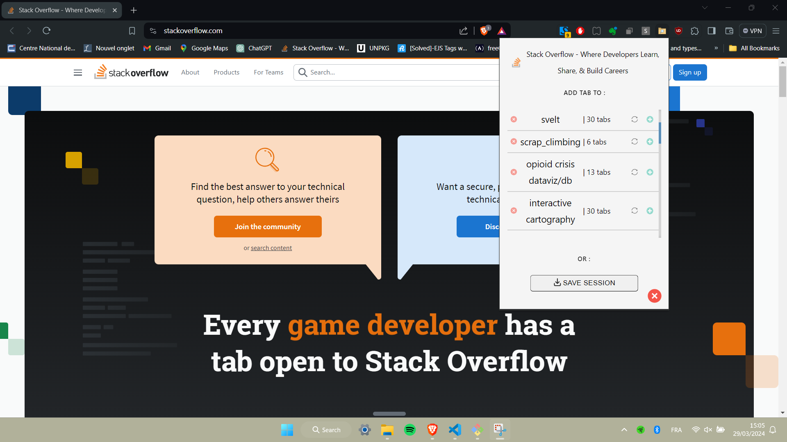

# Browser-sessions-manager
A minimalist and easy-to-use web extension that save open tabs as collections that can be easily restored and modify later.

This web extension response to the need of a bookmark manager that keeps things simple for day to day web research.
It aims to enhance more dynamic and organised browser-based research.

## Features : 
* Display current active tab title and favicon.
* Scrollable display of already existing sessions.
* Each session can be singularly deleted, updated or expanded and have a tracker of the number of tabs it contains.
* Save a new session under a custom name.
* Delete all existing sessions.

## Install the extension :
1. Open the control panel of your browser and select the "Extensions" manager OR Go to chrome://extensions/.
2. At the top right, turn on "Developer mode".
4. Click "Load Unpacked".
5. Find and select the extension folder.
6. Open a new tab in Chrome > click Extensions > click on the Session_Manager extension. Make sure it loads and works correctly.

